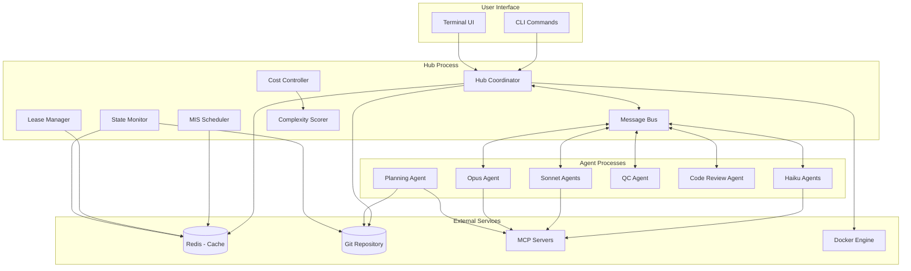
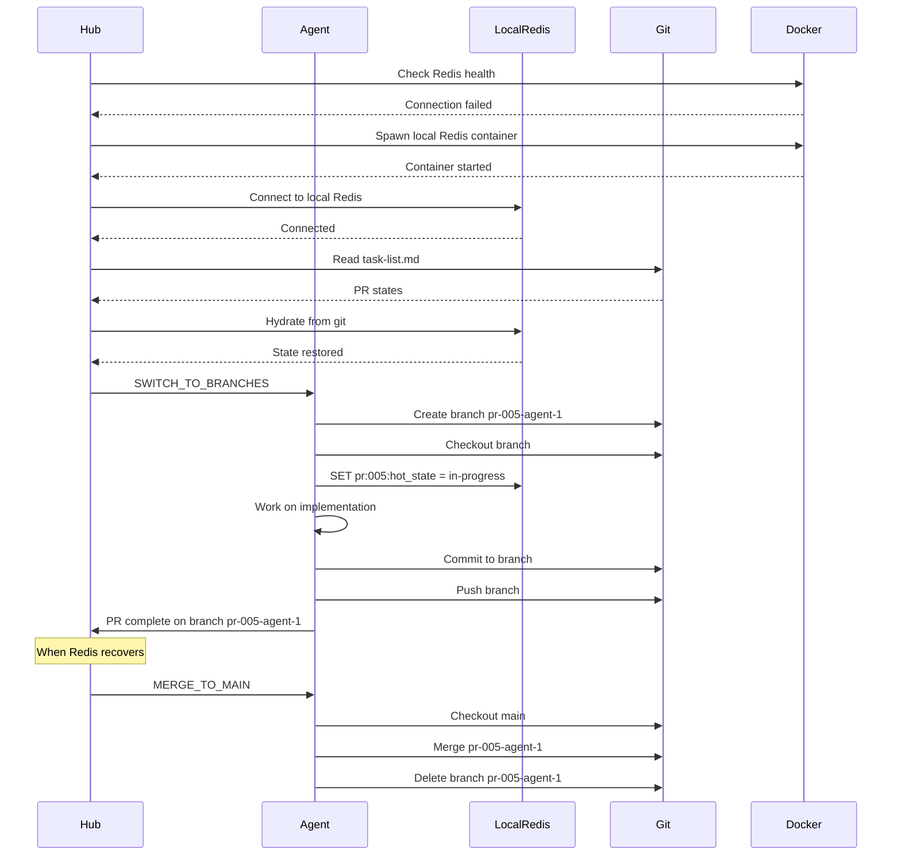
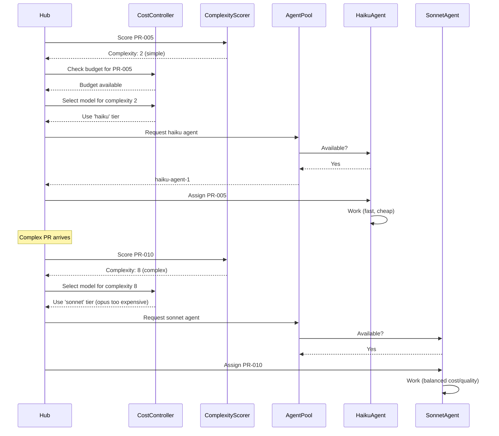

# Lemegeton - Technical Architecture

**Version:** 1.1.0
**Date:** 2025-11-13
**Status:** Updated with Review Feedback

---

## Table of Contents

1. [Architecture Overview](#architecture-overview)
2. [System Components](#system-components)
3. [Data Models](#data-models)
4. [State Machine](#state-machine)
5. [Communication Patterns](#communication-patterns)
6. [Workflow Sequences](#workflow-sequences)
7. [Adapter Interfaces](#adapter-interfaces)
8. [Coordination Modes](#coordination-modes)
9. [Cost Control Architecture](#cost-control-architecture)
10. [Security Architecture](#security-architecture)
11. [Deployment Architecture](#deployment-architecture)
12. [Testing Architecture](#testing-architecture)
13. [Performance Considerations](#performance-considerations)
14. [Future Extensibility](#future-extensibility)

---

## Architecture Overview

### High-Level Architecture



### Core Design Principles

**1. Separation of Concerns**
- **Hub**: Coordination and orchestration only
- **Agents**: Autonomous workers, no cross-agent communication
- **Redis**: Ephemeral cache (not database), reconstructible from git
- **Git**: Durable state (source of truth)

**2. Dual-Mode Coordination**
- **Normal Mode**: Pessimistic locking via Redis prevents conflicts
- **Degraded Mode**: Optimistic branch-based work accepts conflicts
- **Isolated Mode**: Pure local work when fully disconnected
- Prioritizes productivity over perfect coordination when degraded

**3. Hot/Cold State Separation**
- **Cold states**: Durable checkpoints in git
- **Hot states**: Ephemeral work-in-progress in Redis
- Clear boundary: cold transitions commit, hot transitions don't

**4. Fail-Safe Design**
- Agent crashes don't corrupt state
- Redis failure triggers graceful degradation
- Hub crash recoverable via git reconstruction
- Heartbeat system prevents stale leases
- Auto-spawn Redis in Docker if missing

**5. Observable System**
- All agent actions visible in TUI
- MCP queries logged with results
- State transitions traceable in git
- Cost tracking in real-time
- Coordination mode clearly displayed

**6. Tool Agnostic**
- Support for Claude, OpenCode, self-hosted models
- Provider-independent cost controls
- Configurable model tiers
- Works with any LLM that exposes API

---

## System Components

### Hub Coordinator (Enhanced)

**Responsibilities:**
- Parse task-list.md on startup, hydrate Redis
- Auto-spawn Redis in Docker if not present
- Detect coordination mode (distributed/degraded/isolated)
- Spawn and monitor agent processes
- Assign work based on PR complexity and agent capabilities
- Monitor agent heartbeats (30s interval)
- Synchronize state between Redis and git
- Route user input from TUI to agents
- Track costs and enforce budgets
- Handle graceful degradation

**Coordination Mode Detection:**
```typescript
class Hub {
  private coordinationMode: CoordinationMode = CoordinationMode.DISTRIBUTED;
  private redis: RedisClient | null = null;
  private costController: CostController;
  private complexityScorer: ComplexityScorer;

  async start() {
    // Try to establish Redis connection
    this.coordinationMode = await this.detectCoordinationMode();

    switch (this.coordinationMode) {
      case CoordinationMode.DISTRIBUTED:
        await this.startDistributedMode();
        break;
      case CoordinationMode.DEGRADED:
        await this.startDegradedMode();
        break;
      case CoordinationMode.ISOLATED:
        await this.startIsolatedMode();
        break;
    }

    console.log(`Hub started in ${this.coordinationMode} mode`);
  }

  private async detectCoordinationMode(): Promise<CoordinationMode> {
    // Try shared Redis first
    if (await this.trySharedRedis()) {
      return CoordinationMode.DISTRIBUTED;
    }

    // Try local Redis with Docker
    if (await this.tryLocalRedisDocker()) {
      return CoordinationMode.DEGRADED;
    }

    // Fallback to isolated mode
    console.warn('No Redis available - running in isolated mode');
    return CoordinationMode.ISOLATED;
  }

  private async trySharedRedis(): Promise<boolean> {
    try {
      this.redis = await RedisClient.connect(process.env.REDIS_URL);
      await this.redis.ping();
      return true;
    } catch {
      return false;
    }
  }

  private async tryLocalRedisDocker(): Promise<boolean> {
    try {
      // Auto-spawn Redis in Docker
      const docker = new Docker();
      await docker.run('redis:7-alpine', {
        name: 'lemegeton-redis',
        ports: { '6379/tcp': '6379' },
        detach: true
      });

      // Connect to local Redis
      this.redis = await RedisClient.connect('redis://localhost:6379');

      // Hydrate from git
      await this.hydrateRedisFromGit();
      return true;
    } catch {
      return false;
    }
  }

  private async hydrateRedisFromGit() {
    const taskList = await this.git.readTaskList();
    for (const pr of taskList.prs) {
      await this.redis.set(`pr:${pr.id}:cold_state`, pr.cold_state);
      await this.redis.set(`pr:${pr.id}:dependencies`, JSON.stringify(pr.dependencies));
      // Don't restore hot states - they're ephemeral
    }
  }
}
```

### Planning Agent with Speculative Execution

**New Capabilities:**
- Analyzes task patterns for optimization
- Predicts likely conflicts and bottlenecks
- Suggests optimal agent allocation
- Recommends model tiers based on complexity
- Pre-fetches documentation for complex tasks

```typescript
class PlanningAgent extends BaseAgent {
  async generateTaskList(spec: string) {
    // Standard task generation
    const tasks = await this.createTasks(spec);

    // NEW: Speculative execution
    const speculation = await this.speculativeAnalysis(tasks);

    // Annotate tasks with predictions
    for (const task of tasks) {
      task.complexity = speculation.complexityScores[task.id];
      task.likelyConflicts = speculation.conflicts[task.id];
      task.suggestedModel = speculation.modelRecommendations[task.id];
      task.prefetchDocs = speculation.documentationNeeds[task.id];
    }

    // Add metadata for Hub
    const metadata = {
      suggestedAgentCount: speculation.optimalAgentCount,
      suggestedModelMix: speculation.modelMix,
      criticalPath: speculation.criticalPath,
      parallelizationFactor: speculation.parallelizationScore
    };

    return { tasks, metadata };
  }

  private async speculativeAnalysis(tasks: Task[]) {
    const analysis = {
      complexityScores: {},
      conflicts: {},
      modelRecommendations: {},
      documentationNeeds: {},
      optimalAgentCount: 4,
      modelMix: { haiku: 0, sonnet: 0, opus: 0 },
      criticalPath: [],
      parallelizationScore: 0
    };

    // Analyze each task
    for (const task of tasks) {
      // Score complexity
      const complexity = this.scoreComplexity(task);
      analysis.complexityScores[task.id] = complexity;

      // Recommend model based on complexity
      if (complexity < 3) {
        analysis.modelRecommendations[task.id] = 'haiku';
        analysis.modelMix.haiku++;
      } else if (complexity < 7) {
        analysis.modelRecommendations[task.id] = 'sonnet';
        analysis.modelMix.sonnet++;
      } else {
        analysis.modelRecommendations[task.id] = 'opus';
        analysis.modelMix.opus++;
      }

      // Predict file conflicts
      const conflicts = this.predictConflicts(task, tasks);
      if (conflicts.length > 0) {
        analysis.conflicts[task.id] = conflicts;
      }

      // Identify documentation needs
      if (task.description.includes('API') || task.description.includes('integration')) {
        analysis.documentationNeeds[task.id] = this.identifyAPIs(task);
      }
    }

    // Calculate optimal agent count based on parallelization potential
    const dependencyGraph = this.buildDependencyGraph(tasks);
    analysis.parallelizationScore = this.calculateParallelization(dependencyGraph);
    analysis.optimalAgentCount = Math.min(10, Math.max(2,
      Math.floor(analysis.parallelizationScore * tasks.length / 10)
    ));

    // Identify critical path
    analysis.criticalPath = this.findCriticalPath(dependencyGraph);

    return analysis;
  }

  private scoreComplexity(task: Task): number {
    let score = 0;

    // File count factor
    score += task.estimatedFiles * 0.5;

    // Dependency factor
    score += task.dependencies.length * 1;

    // Keyword analysis
    const keywords = {
      complex: 3,
      architecture: 3,
      refactor: 2,
      algorithm: 2,
      optimize: 2,
      integration: 2,
      simple: -2,
      basic: -2,
      trivial: -2,
      crud: -1
    };

    for (const [keyword, weight] of Object.entries(keywords)) {
      if (task.description.toLowerCase().includes(keyword)) {
        score += weight;
      }
    }

    // Normalize to 1-10
    return Math.max(1, Math.min(10, score));
  }
}
```

### QC Agent with Incremental Testing

**Enhanced Capabilities:**
- Identifies changed files from PR
- Runs only related tests (Phase 0.2)
- Integrates with build tools (Phase 0.3/1.0)
- Tracks test execution time for optimization

```typescript
class QCAgent extends BaseAgent {
  private testStrategy: 'full' | 'incremental' = 'incremental';

  async testPR(prId: string) {
    const changedFiles = await this.getChangedFiles(prId);

    if (this.testStrategy === 'incremental') {
      await this.runIncrementalTests(changedFiles);
    } else {
      await this.runFullTestSuite();
    }
  }

  private async runIncrementalTests(changedFiles: string[]) {
    // Phase 0.2: Simple approach
    const testFiles = await this.findRelatedTests(changedFiles);

    this.log(`Running incremental tests for ${testFiles.length} files`);

    // Framework-specific test execution
    const framework = await this.detectTestFramework();

    switch (framework) {
      case 'jest':
        await this.bash(`npm test -- --findRelatedTests ${changedFiles.join(' ')}`);
        break;

      case 'pytest':
        const pyTestFiles = testFiles.filter(f => f.endsWith('.py'));
        await this.bash(`pytest ${pyTestFiles.join(' ')}`);
        break;

      case 'go':
        const packages = this.getGoPackages(changedFiles);
        await this.bash(`go test ${packages.join(' ')}`);
        break;

      default:
        // Fallback to running specific test files
        await this.runTestFiles(testFiles);
    }
  }

  private async findRelatedTests(changedFiles: string[]): Promise<string[]> {
    const testFiles = new Set<string>();

    for (const file of changedFiles) {
      // 1. Direct test files
      const directTest = this.getTestFile(file);
      if (await this.fileExists(directTest)) {
        testFiles.add(directTest);
      }

      // 2. Find files that import this file
      const importers = await this.findImporters(file);
      for (const importer of importers) {
        const importerTest = this.getTestFile(importer);
        if (await this.fileExists(importerTest)) {
          testFiles.add(importerTest);
        }
      }

      // 3. Integration tests that might touch this code
      const integrationTests = await this.findIntegrationTests(file);
      integrationTests.forEach(t => testFiles.add(t));
    }

    return Array.from(testFiles);
  }

  // Phase 0.3/1.0: Advanced approach with build tools
  private async runIncrementalTestsAdvanced(changedFiles: string[]) {
    const buildTool = await this.detectBuildTool();

    switch (buildTool) {
      case 'nx':
        // Nx understands project dependencies
        const affected = await this.bash('nx affected:test --base=main');
        break;

      case 'turborepo':
        // Turborepo with caching
        await this.bash('turbo run test --filter=[main]');
        break;

      case 'bazel':
        // Bazel with incremental builds
        const targets = await this.getBazelTargets(changedFiles);
        await this.bash(`bazel test ${targets.join(' ')}`);
        break;

      default:
        // Fall back to simple approach
        await this.runIncrementalTests(changedFiles);
    }
  }
}
```

### Cost Controller

**New Component:**
```typescript
interface CostConfig {
  provider: 'anthropic' | 'openai' | 'self-hosted' | 'opencode';
  limits?: {
    max_tokens_per_pr?: number;
    max_tokens_per_hour?: number;
    max_api_calls_per_pr?: number;
    max_cost_per_day?: number;
  };
  models?: {
    simple_tasks?: string;  // 'claude-3-haiku' or local model
    complex_tasks?: string; // 'claude-3-sonnet'
    review_tasks?: string;  // 'claude-3-opus'
  };
  fallback_behavior: 'pause' | 'degrade' | 'continue';
  pricing?: {
    // Cost per 1M tokens
    haiku_input?: number;
    haiku_output?: number;
    sonnet_input?: number;
    sonnet_output?: number;
    opus_input?: number;
    opus_output?: number;
  };
}

class CostController {
  private usage: Map<string, UsageMetrics> = new Map();
  private config: CostConfig;

  async shouldProceed(agentId: string, prId: string, estimatedTokens: number): Promise<boolean> {
    const prUsage = this.usage.get(prId) || { tokens: 0, cost: 0, api_calls: 0 };
    const hourlyUsage = this.getHourlyUsage();

    // Check limits
    if (this.config.limits?.max_tokens_per_pr &&
        prUsage.tokens + estimatedTokens > this.config.limits.max_tokens_per_pr) {

      if (this.config.fallback_behavior === 'pause') {
        this.log(`PR ${prId} exceeding token limit - pausing`);
        return false;
      } else if (this.config.fallback_behavior === 'degrade') {
        this.log(`PR ${prId} exceeding limit - degrading to cheaper model`);
        // Signal to use cheaper model
        return true;
      }
    }

    // Check hourly limits
    if (this.config.limits?.max_tokens_per_hour &&
        hourlyUsage + estimatedTokens > this.config.limits.max_tokens_per_hour) {
      this.log(`Hourly token limit approaching - ${this.config.fallback_behavior}`);
      return this.config.fallback_behavior !== 'pause';
    }

    return true;
  }

  selectModelForComplexity(complexity: number): string {
    // For self-hosted/OpenCode, might always return same model
    if (this.config.provider === 'self-hosted' || this.config.provider === 'opencode') {
      return this.config.models?.simple_tasks || 'default';
    }

    // For cloud providers, route by complexity
    if (complexity < 3) {
      return this.config.models?.simple_tasks || 'claude-3-haiku';
    } else if (complexity < 7) {
      return this.config.models?.complex_tasks || 'claude-3-sonnet';
    } else {
      return this.config.models?.review_tasks || 'claude-3-opus';
    }
  }

  trackUsage(prId: string, agentId: string, tokens: number, model: string) {
    const prUsage = this.usage.get(prId) || { tokens: 0, cost: 0, api_calls: 0 };

    prUsage.tokens += tokens;
    prUsage.api_calls++;

    // Calculate cost if pricing configured
    if (this.config.pricing) {
      const cost = this.calculateCost(tokens, model);
      prUsage.cost += cost;
    }

    this.usage.set(prId, prUsage);

    // Publish metrics for TUI display
    this.publishMetrics({
      prId,
      agentId,
      tokens,
      model,
      totalCost: prUsage.cost,
      totalTokens: prUsage.tokens
    });
  }
}
```

### Heterogeneous Agent Pools

**Agent Pool Manager:**
```typescript
class AgentPoolManager {
  private pools: Map<string, AgentPool> = new Map();

  constructor(private config: PoolConfig) {
    // Initialize pools based on config
    if (config.haiku_count > 0) {
      this.pools.set('haiku', new AgentPool('haiku', config.haiku_count));
    }
    if (config.sonnet_count > 0) {
      this.pools.set('sonnet', new AgentPool('sonnet', config.sonnet_count));
    }
    if (config.opus_count > 0) {
      this.pools.set('opus', new AgentPool('opus', config.opus_count));
    }
  }

  async assignAgent(pr: PR, complexity: number): Promise<Agent> {
    const recommendedModel = this.getRecommendedModel(complexity);

    // Try to get agent from recommended pool
    let agent = this.pools.get(recommendedModel)?.getAvailable();

    // Fallback to other pools if needed
    if (!agent) {
      // Try next tier up
      const fallbackOrder = this.getFallbackOrder(recommendedModel);
      for (const modelTier of fallbackOrder) {
        agent = this.pools.get(modelTier)?.getAvailable();
        if (agent) break;
      }
    }

    if (!agent) {
      throw new Error('No available agents in any pool');
    }

    agent.assignPR(pr);
    return agent;
  }

  private getRecommendedModel(complexity: number): string {
    if (complexity < 3) return 'haiku';
    if (complexity < 7) return 'sonnet';
    return 'opus';
  }

  private getFallbackOrder(model: string): string[] {
    switch (model) {
      case 'haiku':
        return ['sonnet', 'opus'];
      case 'sonnet':
        return ['opus', 'haiku']; // Opus for quality, Haiku if desperate
      case 'opus':
        return ['sonnet', 'haiku'];
      default:
        return ['sonnet', 'haiku', 'opus'];
    }
  }
}

class AgentPool {
  private agents: Agent[] = [];

  constructor(private modelTier: string, private size: number) {
    for (let i = 0; i < size; i++) {
      this.agents.push(new CodingAgent({
        id: `${modelTier}-agent-${i + 1}`,
        model: this.getModelName(modelTier)
      }));
    }
  }

  getAvailable(): Agent | null {
    return this.agents.find(a => !a.isBusy()) || null;
  }

  private getModelName(tier: string): string {
    const mapping = {
      'haiku': 'claude-3-haiku-20240307',
      'sonnet': 'claude-3-5-sonnet-20241022',
      'opus': 'claude-3-opus-20240229'
    };
    return mapping[tier] || tier;
  }
}
```

---

## Coordination Modes

### Mode Detection and Switching

```typescript
enum CoordinationMode {
  DISTRIBUTED = "distributed",    // Normal: shared Redis, file leases
  DEGRADED = "degraded",          // Fallback: local Redis + git branches
  ISOLATED = "isolated"           // Emergency: pure local work
}

class CoordinationModeManager {
  private currentMode: CoordinationMode = CoordinationMode.DISTRIBUTED;
  private lastModeChange: Date = new Date();

  async detectAndSwitch(): Promise<CoordinationMode> {
    const newMode = await this.detectBestMode();

    if (newMode !== this.currentMode) {
      await this.switchMode(this.currentMode, newMode);
      this.currentMode = newMode;
      this.lastModeChange = new Date();
    }

    return this.currentMode;
  }

  private async detectBestMode(): Promise<CoordinationMode> {
    // Check shared Redis
    if (await this.canReachSharedRedis()) {
      return CoordinationMode.DISTRIBUTED;
    }

    // Check local Docker
    if (await this.canUseDocker()) {
      return CoordinationMode.DEGRADED;
    }

    // Fallback to isolated
    return CoordinationMode.ISOLATED;
  }

  private async switchMode(from: CoordinationMode, to: CoordinationMode) {
    console.log(`Switching coordination mode: ${from} → ${to}`);

    if (from === CoordinationMode.DISTRIBUTED && to === CoordinationMode.DEGRADED) {
      // Moving to degraded - switch agents to branches
      await this.notifyAgents('SWITCH_TO_BRANCHES');
      await this.spawnLocalRedis();
      await this.hydrateFromGit();
    } else if (from === CoordinationMode.DEGRADED && to === CoordinationMode.ISOLATED) {
      // Lost all Redis - pure local work
      await this.notifyAgents('WORK_ISOLATED');
      await this.saveStateToFiles();
    } else if (from === CoordinationMode.ISOLATED && to === CoordinationMode.DEGRADED) {
      // Regained local Redis
      await this.notifyAgents('RESUME_COORDINATION');
      await this.restoreFromFiles();
    } else if (from === CoordinationMode.DEGRADED && to === CoordinationMode.DISTRIBUTED) {
      // Back to normal - merge branches
      await this.notifyAgents('MERGE_TO_MAIN');
      await this.reconcileState();
    }
  }

  private async notifyAgents(action: string) {
    // Broadcast mode change to all agents
    await this.messageBus.broadcast('coordination:mode_change', {
      action,
      newMode: this.currentMode,
      timestamp: new Date()
    });
  }
}
```

### Branch-Based Work in Degraded Mode

```typescript
class DegradedModeAgent extends BaseAgent {
  private branch: string;

  async startWork(pr: PR) {
    // Create feature branch for this PR
    this.branch = `pr-${pr.id}-${this.id}`;
    await this.git.createBranch(this.branch);
    await this.git.checkout(this.branch);

    // Work normally, but on branch
    await this.implement(pr);

    // Commit to branch
    await this.git.commit(`[${this.id}] Implement ${pr.id} (degraded mode)`);

    // Push branch
    await this.git.push('origin', this.branch);

    // Mark PR with branch info
    await this.markPRComplete(pr, this.branch);
  }

  async reconcileAfterDegraded() {
    // When returning to distributed mode
    try {
      // Try automatic merge
      await this.git.checkout('main');
      await this.git.merge(this.branch);
      await this.git.deleteBranch(this.branch);
    } catch (error) {
      // Merge conflict - needs manual resolution
      this.log(`Merge conflict in branch ${this.branch} - manual resolution required`);
      await this.createMergeRequest(this.branch);
    }
  }
}
```

---

## Data Models (Updated)

### Redis Keys (Enhanced)

```typescript
// PR State
`pr:{prId}:cold_state`           // string: cold state value
`pr:{prId}:hot_state`            // string: hot state value (ephemeral)
`pr:{prId}:agent`                // string: agent_id (ephemeral)
`pr:{prId}:dependencies`         // set: dependency PRs
`pr:{prId}:leases`               // string: JSON array of file paths
`pr:{prId}:complexity`           // number: 1-10 complexity score
`pr:{prId}:suggested_model`      // string: 'haiku' | 'sonnet' | 'opus'
`pr:{prId}:token_usage`          // number: tokens used so far
`pr:{prId}:cost`                 // number: estimated cost

// File Leases
`file:{path}:lease`              // string: agent_id (TTL: 5 minutes)

// Agent State
`agent:{agentId}:heartbeat`      // string: timestamp (TTL: 5 minutes)
`agent:{agentId}:model`          // string: model being used
`agent:{agentId}:current_pr`     // string: PR being worked on

// Cost Tracking
`cost:hourly:{hour}`             // number: tokens used this hour
`cost:daily:{date}`              // number: tokens used today
`cost:pr:{prId}`                 // JSON: detailed cost breakdown

// Coordination
`coordination:mode`              // string: current mode
`coordination:redis_health`      // string: 'healthy' | 'degraded' | 'failed'
```

### TypeScript Interfaces (Enhanced)

```typescript
interface PRState {
  pr_id: string;
  cold_state: ColdState;
  hot_state?: HotState;
  agent_id?: string;
  dependencies: string[];
  files_locked: string[];
  last_transition: string;
  // New fields
  complexity?: PRComplexity;
  branch?: string;              // For degraded mode
  token_usage?: number;
  estimated_cost?: number;
}

interface PRComplexity {
  score: number;                 // 1-10
  estimated_minutes: number;
  file_count: number;
  dependency_count: number;
  suggested_model: 'haiku' | 'sonnet' | 'opus';
  rationale: string;
  likely_conflicts?: string[];   // From speculative execution
  prefetch_docs?: string[];      // Documentation to pre-fetch
}

interface AgentCapabilities {
  type: 'coding' | 'qc' | 'review' | 'planning';
  languages: string[];
  can_plan: boolean;
  can_implement: boolean;
  can_test: boolean;
  model_tier: 'haiku' | 'sonnet' | 'opus';  // New field
  cost_per_token?: number;                  // For cost tracking
}

interface CoordinationState {
  mode: CoordinationMode;
  redis_available: boolean;
  docker_available: boolean;
  agents_on_branches: boolean;
  last_mode_change: Date;
  degradation_reason?: string;
}

interface CostMetrics {
  pr_id: string;
  agent_id: string;
  model: string;
  tokens_used: number;
  estimated_cost: number;
  api_calls: number;
  timestamp: Date;
}
```

---

## Workflow Sequences (Updated)

### Degraded Mode Workflow



### Cost-Optimized Agent Selection



---

## Adapter Interfaces (Enhanced)

### Cost Adapter

```typescript
interface CostAdapter {
  // Provider-specific implementation
  calculateCost(tokens: number, model: string): number;
  getModelPricing(model: string): ModelPricing;
  isWithinBudget(usage: UsageMetrics, limits: CostLimits): boolean;

  // For self-hosted/OpenCode
  isFreeModel(): boolean;
}

class AnthropicCostAdapter implements CostAdapter {
  private pricing = {
    'claude-3-haiku': { input: 0.25, output: 1.25 },      // per 1M tokens
    'claude-3-sonnet': { input: 3.00, output: 15.00 },
    'claude-3-opus': { input: 15.00, output: 75.00 }
  };

  calculateCost(tokens: number, model: string): number {
    const price = this.pricing[model];
    if (!price) return 0;

    // Simplified - would need to track input vs output
    return (tokens / 1_000_000) * price.output;
  }

  isFreeModel(): boolean {
    return false;
  }
}

class SelfHostedCostAdapter implements CostAdapter {
  calculateCost(tokens: number, model: string): number {
    return 0; // No marginal cost for self-hosted
  }

  isFreeModel(): boolean {
    return true;
  }
}
```

### Incremental Test Adapter

```typescript
interface TestAdapter {
  findRelatedTests(changedFiles: string[]): Promise<string[]>;
  runTests(testFiles: string[]): Promise<TestResult>;
  detectFramework(): Promise<TestFramework>;
  supportIncremental(): boolean;
}

class JestTestAdapter implements TestAdapter {
  async findRelatedTests(changedFiles: string[]): Promise<string[]> {
    // Use Jest's built-in functionality
    const result = await exec(
      `npx jest --listTests --findRelatedTests ${changedFiles.join(' ')}`
    );
    return result.stdout.split('\n').filter(Boolean);
  }

  async runTests(testFiles: string[]): Promise<TestResult> {
    const result = await exec(
      `npx jest --json --findRelatedTests ${testFiles.join(' ')}`
    );
    return JSON.parse(result.stdout);
  }

  supportIncremental(): boolean {
    return true;
  }
}

class NxTestAdapter implements TestAdapter {
  async findRelatedTests(changedFiles: string[]): Promise<string[]> {
    // Nx understands project dependencies
    const affected = await exec('npx nx affected:test --base=main --plain');
    return affected.stdout.split(' ');
  }

  async runTests(projects: string[]): Promise<TestResult> {
    const result = await exec(`npx nx run-many --target=test --projects=${projects.join(',')}`);
    return this.parseNxResult(result);
  }

  supportIncremental(): boolean {
    return true; // Nx excels at incremental
  }
}
```

### Memory Adapter

The Memory Adapter pattern enables smooth migration from file-based to vector database storage for the memory bank system.

```typescript
interface MemoryAdapter {
  // Basic CRUD operations
  read(file: MemoryFile): Promise<string>;
  write(file: MemoryFile, content: string): Promise<void>;
  exists(file: MemoryFile): Promise<boolean>;

  // Batch operations
  readAll(): Promise<MemoryBankSnapshot>;
  writeAll(snapshot: MemoryBankSnapshot): Promise<void>;

  // Query capabilities (simple for file-based, semantic for vector DB)
  query(question: string, options?: QueryOptions): Promise<MemoryQueryResult[]>;
}
```

**Phase 0.1a-0.3: FileMemoryAdapter**

```typescript
class FileMemoryAdapter implements MemoryAdapter {
  private baseDir: string;
  private fileMap: Map<MemoryFile, string> = new Map([
    [MemoryFile.SystemPatterns, 'docs/memory/systemPatterns.md'],
    [MemoryFile.TechContext, 'docs/memory/techContext.md'],
    [MemoryFile.ActiveContext, 'docs/memory/activeContext.md'],
    [MemoryFile.Progress, 'docs/memory/progress.md'],
  ]);

  async read(file: MemoryFile): Promise<string> {
    const filePath = this.getFilePath(file);
    try {
      return await fs.readFile(filePath, 'utf8');
    } catch (error) {
      // Return default template if file doesn't exist
      return this.getDefaultContent(file);
    }
  }

  async write(file: MemoryFile, content: string): Promise<void> {
    const filePath = this.getFilePath(file);

    // Atomic write: temp file + rename
    const tempPath = `${filePath}.tmp`;
    await fs.writeFile(tempPath, content, 'utf8');
    await fs.rename(tempPath, filePath);
  }

  async query(question: string, options?: QueryOptions): Promise<MemoryQueryResult[]> {
    // Simple keyword matching
    // More sophisticated search can be added later
    const files = options?.fileFilter || [all memory files];
    const results: MemoryQueryResult[] = [];

    for (const file of files) {
      const content = await this.read(file);
      if (this.matchesQuery(content, question)) {
        results.push({
          file,
          content,
          excerpt: this.extractExcerpt(content, question),
        });
      }
    }

    return results;
  }
}
```

**Phase 1.0+: VectorMemoryAdapter**

```typescript
class VectorMemoryAdapter implements MemoryAdapter {
  private vectorDB: VectorDBClient; // ChromaDB, Pinecone, Weaviate, etc.
  private embedder: EmbeddingModel;
  private fileAdapter: FileMemoryAdapter; // Fallback for writes

  async query(question: string, options?: QueryOptions): Promise<MemoryQueryResult[]> {
    // 1. Generate embedding for question
    const embedding = await this.embedder.embed(question);

    // 2. Perform vector similarity search
    const results = await this.vectorDB.search(embedding, {
      k: options?.k || 5,
      filter: options?.fileFilter,
    });

    // 3. Return ranked results with relevance scores
    return results.map(result => ({
      file: result.metadata.file,
      content: result.text,
      relevance: result.score,
      excerpt: this.extractExcerpt(result.text, question),
    }));
  }

  // Read/write operations delegate to file adapter for now
  async read(file: MemoryFile): Promise<string> {
    return this.fileAdapter.read(file);
  }

  async write(file: MemoryFile, content: string): Promise<void> {
    await this.fileAdapter.write(file, content);

    // Also update vector DB with new embeddings
    const embedding = await this.embedder.embed(content);
    await this.vectorDB.upsert({
      id: file,
      embedding,
      text: content,
      metadata: { file },
    });
  }
}
```

**Benefits of Adapter Pattern:**

- **No consumer code changes**: MemoryBank service uses MemoryAdapter interface, doesn't care about storage backend
- **Progressive enhancement**: Start with simple file-based storage, migrate to vector DB when needed
- **Testable**: Same test suite validates both implementations
- **Query evolution**: Simple keyword search → semantic similarity without API changes

**Memory Bank Service Integration:**

```typescript
class MemoryBank {
  private adapter: MemoryAdapter;
  private redis: RedisClient;

  constructor(adapter: MemoryAdapter, redis: RedisClient) {
    this.adapter = adapter;
    this.redis = redis;
  }

  async read(file: MemoryFile): Promise<string> {
    // Try Redis cache first
    const cached = await this.redis.get(`memory:${file}`);
    if (cached) return cached;

    // Fallback to adapter (file system or vector DB)
    const content = await this.adapter.read(file);

    // Cache in Redis (1 hour TTL)
    await this.redis.setex(`memory:${file}`, 3600, content);

    return content;
  }

  async write(file: MemoryFile, content: string): Promise<void> {
    // Write to adapter (durable storage)
    await this.adapter.write(file, content);

    // Invalidate and update cache
    await this.redis.del(`memory:${file}`);
    await this.redis.setex(`memory:${file}`, 3600, content);
  }

  async query(question: string, options?: QueryOptions): Promise<MemoryQueryResult[]> {
    // Query uses appropriate backend (keyword or semantic)
    return this.adapter.query(question, options);
  }
}
```

**Migration Path:**

1. **Phase 0.1a**: Use FileMemoryAdapter with simple keyword search
2. **Phase 0.3**: Enhance file queries with grep-like search
3. **Phase 1.0**: Implement VectorMemoryAdapter with ChromaDB/Pinecone
4. **Phase 1.5**: A/B test query quality between keyword and semantic
5. **Phase 2.0**: Fully migrate to vector DB, keep file adapter for write fallback

The adapter pattern ensures this migration happens transparently to consumers. The MemoryBank service and all agents continue using the same API regardless of storage backend.

---

## Security Architecture (Updated)

### Environment Variables (Enhanced)

```bash
# Required
REDIS_URL=redis://localhost:6379       # Optional with auto-spawn

# Cost Control
COST_PROVIDER=anthropic               # or openai, self-hosted, opencode
MAX_TOKENS_PER_DAY=1000000
MAX_COST_PER_DAY=100
FALLBACK_BEHAVIOR=degrade             # or pause, continue

# Model Configuration
HAIKU_MODEL=claude-3-haiku-20240307
SONNET_MODEL=claude-3-5-sonnet-20241022
OPUS_MODEL=claude-3-opus-20240229

# For self-hosted/OpenCode
OPENCODE_ENDPOINT=http://localhost:8080
OPENCODE_MODEL=llama-70b

# MCP Servers (optional)
GITHUB_TOKEN=ghp_...
BRAVE_API_KEY=...

# Docker (optional)
DOCKER_SOCKET=/var/run/docker.sock
```

---

### Package Structure & Distribution

#### NPM Package Layout

```
lemegeton/                          # Published to npm
├── dist/                           # Compiled JavaScript
│   ├── hub/
│   ├── agents/
│   ├── adapters/
│   ├── ui/
│   └── cli/
├── prompts/                        # Default prompts (bundled)
│   ├── agent-planning.md
│   ├── coding-agent.md
│   └── qc-agent.md
├── bin/
│   └── lemegeton.js               # CLI entry point
├── package.json
└── README.md

# NOT in package (stays in user's project):
.lemegeton/                        # Created by 'lemegeton init'
├── config.yaml                    # User's configuration
└── prompts/                       # Optional overrides
    └── agent-planning.md          # Override default prompt

docs/                              # Created by Planning Agent
├── prd.md
├── task-list.md
└── memory/                        # Created during execution
    ├── systemPatterns.md
    ├── techContext.md
    ├── activeContext.md
    └── progress.md
```

#### CLI Entry Point

```typescript
#!/usr/bin/env node
// bin/lemegeton.js

import { Command } from 'commander';
import { HubCommand } from '../dist/cli/hub.js';
import { RunCommand } from '../dist/cli/run.js';
import { PlanCommand } from '../dist/cli/plan.js';

const program = new Command();

program
  .name('lemegeton')
  .description('AI agent orchestration for parallel development')
  .version('1.0.0');

program
  .command('init')
  .description('Initialize Lemegeton in current project')
  .action(async () => {
    const init = new InitCommand();
    await init.execute();
  });

program
  .command('hub')
  .description('Manage Hub daemon')
  .argument('<action>', 'start | stop | status')
  .action(async (action) => {
    const hub = new HubCommand();
    await hub.execute(action);
  });

program
  .command('run')
  .description('Spawn coding agents')
  .option('-a, --agents <count>', 'Number of agents', '4')
  .action(async (options) => {
    const run = new RunCommand();
    await run.execute(options);
  });

program
  .command('plan')
  .description('Generate PRD and task list from spec')
  .argument('<spec>', 'Path to spec file')
  .option('-i, --interactive', 'Interactive mode', true)
  .action(async (spec, options) => {
    const plan = new PlanCommand();
    await plan.execute(spec, options);
  });

program.parse();
```

#### Initialization Command

```typescript
class InitCommand {
  async execute() {
    const projectRoot = process.cwd();
    
    console.log('🚀 Initializing Lemegeton in', projectRoot);
    
    // 1. Create .lemegeton directory
    const lemegetonDir = path.join(projectRoot, '.lemegeton');
    await fs.mkdir(lemegetonDir, { recursive: true });
    
    // 2. Create default config
    const configPath = path.join(lemegetonDir, 'config.yaml');
    if (!fs.existsSync(configPath)) {
      await fs.writeFile(configPath, this.getDefaultConfig());
      console.log('✓ Created .lemegeton/config.yaml');
    } else {
      console.log('⚠ .lemegeton/config.yaml already exists, skipping');
    }
    
    // 3. Create docs directory
    const docsDir = path.join(projectRoot, 'docs');
    await fs.mkdir(docsDir, { recursive: true });
    await fs.writeFile(path.join(docsDir, '.gitkeep'), '');
    console.log('✓ Created docs/ directory');
    
    // 4. Add to .gitignore
    const gitignorePath = path.join(projectRoot, '.gitignore');
    await this.updateGitignore(gitignorePath);
    console.log('✓ Updated .gitignore');
    
    console.log('\n✨ Lemegeton initialized!');
    console.log('\nNext steps:');
    console.log('  1. Edit .lemegeton/config.yaml (add API keys)');
    console.log('  2. Create a spec file: docs/spec.md');
    console.log('  3. Run: lemegeton plan docs/spec.md');
    console.log('  4. Run: lemegeton hub start && lemegeton run --agents=4');
  }
  
  private getDefaultConfig(): string {
    return `# Lemegeton Configuration

# MCP Servers
mcp_servers:
  github:
    enabled: true
    token: $GITHUB_TOKEN  # Optional, increases rate limits
  
  docs:
    enabled: true
    sources: [mdn, npm, pypi, crates_io, go_pkg, docs_rs]
  
  brave_search:
    enabled: true
    api_key: $BRAVE_API_KEY  # Free tier: 2000 queries/month
  
  # Project-specific (disabled by default)
  postgres:
    enabled: false
    connection_string: $DATABASE_URL
  
  stripe:
    enabled: false
    api_key: $STRIPE_SECRET_KEY
  
  aws:
    enabled: false
    credentials: $AWS_CREDENTIALS

# Agent Settings
agents:
  max_parallel: 10
  heartbeat_interval: 30  # seconds
  lease_ttl: 300          # seconds (5 minutes)

# Redis
redis:
  url: redis://localhost:6379
  auto_start: true        # Spawn Docker container if not running

# Git
git:
  auto_commit: true       # Hub auto-commits cold state transitions
  commit_author: lemegeton-hub
`;
  }
  
  private async updateGitignore(gitignorePath: string) {
    let content = '';
    if (fs.existsSync(gitignorePath)) {
      content = await fs.readFile(gitignorePath, 'utf-8');
    }
    
    if (!content.includes('.lemegeton/prompts/')) {
      content += `\n# Lemegeton
.lemegeton/prompts/      # Optional prompt overrides (user-specific)
`;
      await fs.writeFile(gitignorePath, content);
    }
  }
}
```

#### Prompt Loading Strategy

**CLI-Based Approach** (Implemented in PR-003a)

Lemegeton uses CLI commands for prompt access to avoid filesystem permission issues with `node_modules/`:

```bash
# Agents and Hub use these commands to access prompts
npx lemegeton prompt get agent-defaults
npx lemegeton prompt get commit-policy
npx lemegeton prompt list
```

**Benefits:**
- Works from `node_modules` (no gitignore issues)
- No filesystem access needed by agents
- Version-pinned via package.json
- Extensible for future override support

**Implementation:**

```typescript
class PromptLoader {
  private redis: RedisClient;

  // Hybrid Caching Strategy (PR-003a)
  async loadAllPrompts(useCLI: boolean = true): Promise<void> {
    const prompts = ['agent-defaults', 'commit-policy', 'cost-guidelines', 'planning-agent'];

    for (const promptName of prompts) {
      if (useCLI) {
        await this.loadPromptViaCLI(promptName);
      } else {
        await this.loadPrompt(promptName); // Direct filesystem (development)
      }
    }
  }

  async loadPromptViaCLI(name: string): Promise<void> {
    // Call CLI to get prompt content
    const command = `npx lemegeton prompt get ${name}`;
    const content = execSync(command, { encoding: 'utf8' });

    // Parse YAML
    const parsed = yaml.load(content) as Prompt;

    // Validate and cache in Redis
    this.validatePrompt(parsed, name);
    await this.redis.set(`prompt:${name}`, JSON.stringify(parsed));
  }

  // Agents query Redis cache via Hub API
  async getPrompt(name: string): Promise<Prompt> {
    const cached = await this.redis.get(`prompt:${name}`);
    if (!cached) {
      throw new Error(`Prompt not found in cache: ${name}`);
    }
    return JSON.parse(cached);
  }
}
```

**Future Enhancement - User Overrides:**

```typescript
// Planned for Phase 1.0+
async loadPrompt(name: string): Promise<string> {
  // 1. Check for user override in .lemegeton/prompts/
  const overridePath = path.join(process.cwd(), '.lemegeton/prompts', `${name}.yml`);

  if (fs.existsSync(overridePath)) {
    console.log(`📝 Using custom prompt: ${name}.yml`);
    return fs.readFile(overridePath, 'utf-8');
  }

  // 2. Fall back to bundled prompt via CLI
  return execSync(`npx lemegeton prompt get ${name}`, { encoding: 'utf8' });
}
```

#### Configuration Loading

```typescript
class ConfigLoader {
  async loadConfig(): Promise<LemegetonConfig> {
    const configPath = path.join(process.cwd(), '.lemegeton/config.yaml');
    
    if (!fs.existsSync(configPath)) {
      throw new Error(
        'No .lemegeton/config.yaml found. Run "lemegeton init" first.'
      );
    }
    
    const content = await fs.readFile(configPath, 'utf-8');
    const config = yaml.parse(content) as LemegetonConfig;
    
    // Resolve environment variables
    this.resolveEnvVars(config);
    
    // Validate required fields
    this.validate(config);
    
    return config;
  }
  
  private resolveEnvVars(obj: any) {
    for (const key in obj) {
      if (typeof obj[key] === 'string' && obj[key].startsWith('$')) {
        const envVar = obj[key].slice(1);
        obj[key] = process.env[envVar];
      } else if (typeof obj[key] === 'object') {
        this.resolveEnvVars(obj[key]);
      }
    }
  }
}
```

#### package.json

```json
{
  "name": "lemegeton",
  "version": "1.0.0",
  "description": "AI agent orchestration for parallel development",
  "main": "dist/index.js",
  "bin": {
    "lemegeton": "./bin/lemegeton.js"
  },
  "files": [
    "dist/",
    "prompts/",
    "bin/"
  ],
  "scripts": {
    "build": "tsc",
    "test": "jest",
    "prepublishOnly": "npm run build"
  },
  "keywords": [
    "ai",
    "agents",
    "orchestration",
    "development",
    "automation",
    "claude",
    "cursor",
    "codex"
  ],
  "engines": {
    "node": ">=18.0.0"
  },
  "dependencies": {
    "commander": "^11.0.0",
    "redis": "^4.6.0",
    "simple-git": "^3.20.0",
    "yaml": "^2.3.0",
    "blessed": "^0.1.81",
    "dotenv": "^16.3.0"
  },
  "devDependencies": {
    "@types/node": "^20.0.0",
    "typescript": "^5.0.0",
    "jest": "^29.0.0"
  }
}
```

#### Publishing to npm

```bash
# 1. Build
npm run build

# 2. Test locally
npm link
cd ~/test-project
lemegeton init

# 3. Publish
npm publish

# Users can then:
npm install -g lemegeton
# or
npx lemegeton init
```

#### Version Updates

When Lemegeton is updated, users get new features without touching their project files:

```bash
# User's workflow
npm update -g lemegeton

# Their project files stay unchanged:
# - .lemegeton/config.yaml (their settings)
# - docs/prd.md (their project)
# - docs/task-list.md (their work)
# - docs/memory/ (their institutional knowledge)

# But they get:
# - Latest Hub coordinator
# - Latest agent implementations
# - Latest MCP adapters
# - Bug fixes and improvements
```

**Benefits:**
- Hub code doesn't clutter user's project
- Updates are seamless (`npm update`)
- Users only commit their project-specific files
- Easier to maintain (one codebase in npm, not scattered across user repos)

---

## Deployment Architecture (Updated)

### Zero-Config Local Setup

```bash
# Single command startup
$ npx lemegeton hub start

[2025-11-13 10:00:00] 🚀 Lemegeton Hub starting...
[2025-11-13 10:00:01] 🔍 Checking Redis...
[2025-11-13 10:00:01]    Redis not found, spawning Docker container...
[2025-11-13 10:00:03]    ✓ Redis running at localhost:6379
[2025-11-13 10:00:03] 📖 Reading docs/task-list.md...
[2025-11-13 10:00:03]    ✓ Parsed 45 PRs with complexity scores
[2025-11-13 10:00:04] 💰 Cost control enabled (Anthropic)
[2025-11-13 10:00:04]    Daily budget: $100
[2025-11-13 10:00:04]    Fallback: degrade to cheaper models
[2025-11-13 10:00:04] 🤖 Agent pool configuration:
[2025-11-13 10:00:04]    Haiku agents: 6
[2025-11-13 10:00:04]    Sonnet agents: 3
[2025-11-13 10:00:04]    Opus agents: 1
[2025-11-13 10:00:04] ✓ Hub ready (DISTRIBUTED mode)
```

### Docker Compose (Enhanced)

```yaml
version: '3.8'

services:
  redis:
    image: redis:7-alpine
    ports:
      - "6379:6379"
    volumes:
      - redis-data:/data
    command: redis-server --maxmemory 256mb --maxmemory-policy allkeys-lru
    healthcheck:
      test: ["CMD", "redis-cli", "ping"]
      interval: 5s
      timeout: 3s
      retries: 5

  hub:
    build: .
    depends_on:
      redis:
        condition: service_healthy
    environment:
      - REDIS_URL=redis://redis:6379
      - COST_PROVIDER=${COST_PROVIDER:-anthropic}
      - MAX_TOKENS_PER_DAY=${MAX_TOKENS_PER_DAY:-1000000}
      - COORDINATION_MODE=distributed
    volumes:
      - .:/app
      - /var/run/docker.sock:/var/run/docker.sock
    command: npm run hub:start

volumes:
  redis-data:
```

---

## Testing Architecture (Enhanced)

### Cost Control Tests

```typescript
describe('CostController', () => {
  let controller: CostController;

  beforeEach(() => {
    controller = new CostController({
      provider: 'anthropic',
      limits: {
        max_tokens_per_pr: 10000,
        max_cost_per_day: 100
      },
      models: {
        simple_tasks: 'claude-3-haiku',
        complex_tasks: 'claude-3-sonnet'
      },
      fallback_behavior: 'degrade'
    });
  });

  it('selects haiku for simple tasks', () => {
    const model = controller.selectModelForComplexity(2);
    expect(model).toBe('claude-3-haiku');
  });

  it('degrades to cheaper model when approaching limit', async () => {
    // Simulate high usage
    controller.trackUsage('PR-001', 'agent-1', 9000, 'sonnet');

    // Next request should degrade
    const shouldProceed = await controller.shouldProceed('agent-1', 'PR-001', 2000);
    expect(shouldProceed).toBe(true);

    const model = controller.selectModelForComplexity(7); // Normally sonnet
    expect(model).toBe('claude-3-haiku'); // Degraded to haiku
  });
});
```

### Degradation Mode Tests

```typescript
describe('Coordination Mode Manager', () => {
  it('switches to degraded mode when Redis fails', async () => {
    const manager = new CoordinationModeManager();

    // Simulate Redis failure
    mockRedisConnection.fail();

    const mode = await manager.detectAndSwitch();
    expect(mode).toBe(CoordinationMode.DEGRADED);

    // Verify Docker spawned
    expect(dockerMock.run).toHaveBeenCalledWith('redis:7-alpine');

    // Verify agents notified
    expect(messageBus.broadcast).toHaveBeenCalledWith(
      'coordination:mode_change',
      expect.objectContaining({
        action: 'SWITCH_TO_BRANCHES',
        newMode: 'degraded'
      })
    );
  });

  it('reconciles branches when returning to distributed', async () => {
    // Start in degraded
    await manager.switchMode(CoordinationMode.DISTRIBUTED, CoordinationMode.DEGRADED);

    // Work happens on branches
    await agent.workOnBranch('PR-005');

    // Redis recovers
    mockRedisConnection.restore();

    // Switch back
    await manager.switchMode(CoordinationMode.DEGRADED, CoordinationMode.DISTRIBUTED);

    // Verify merge attempted
    expect(gitMock.merge).toHaveBeenCalledWith('pr-005-agent-1');
  });
});
```

### Incremental Test Selection Tests

```typescript
describe('QC Agent Incremental Testing', () => {
  it('runs only related tests for changed files', async () => {
    const qc = new QCAgent();
    const changedFiles = ['src/auth/login.ts'];

    await qc.testPR('PR-005');

    // Should only run auth tests
    expect(bashMock).toHaveBeenCalledWith(
      expect.stringContaining('--findRelatedTests src/auth/login.ts')
    );

    // Should NOT run all tests
    expect(bashMock).not.toHaveBeenCalledWith('npm test');
  });

  it('integrates with Nx for monorepo testing', async () => {
    // Setup Nx environment
    mockFileSystem.addFile('nx.json', '{}');

    const qc = new QCAgent();
    await qc.testPR('PR-010');

    expect(bashMock).toHaveBeenCalledWith('nx affected:test --base=main');
  });
});
```

---

## Performance Considerations (Updated)

### Cost-Optimized Performance

**Token Usage Patterns:**
- Haiku agents: ~5K tokens/PR average (simple tasks)
- Sonnet agents: ~15K tokens/PR average (complex tasks)
- Opus agents: ~30K tokens/PR average (architecture/review)

**Cost Optimization:**
- 60% of PRs → Haiku ($0.01-0.02 each)
- 35% of PRs → Sonnet ($0.05-0.10 each)
- 5% of PRs → Opus ($0.20-0.50 each)
- **Average cost per PR: ~$0.04** (vs $0.10 with all Sonnet)

### Incremental Testing Performance

**Test Execution Times:**
- Full suite: 5-10 minutes
- Incremental (simple approach): 30-60 seconds
- Incremental (with Nx/Turbo): 10-20 seconds

**Cache Hit Rates:**
- First run: 0% cache hits
- Subsequent runs: 70-90% cache hits with build tools
- Saves 80%+ of test execution time

### Degradation Mode Performance

**Mode Switch Overhead:**
- Distributed → Degraded: ~3 seconds (Docker spawn)
- Degraded → Isolated: ~1 second (state save)
- Isolated → Degraded: ~2 seconds (state restore)
- Degraded → Distributed: ~5-10 seconds (branch merges)

**Throughput Impact:**
- Distributed mode: 100% throughput
- Degraded mode: 85-90% throughput (branch overhead)
- Isolated mode: 70-80% throughput (no coordination)

---

## Future Extensibility (Updated)

### Semantic Conflict Detection (v2.0+)

```typescript
interface SemanticLease {
  file: string;
  symbols: string[];           // ['AuthService.login', 'AuthService.logout']
  ast_ranges?: ASTRange[];      // Specific line/column ranges
  semantic_blocks?: string[];  // ['auth-logic', 'validation']
}

class SemanticLeaseManager extends LeaseManager {
  async acquireSemanticLease(
    file: string,
    symbols: string[]
  ): Promise<LeaseResult> {
    // Parse AST to find symbol locations
    const ast = await this.parseAST(file);
    const ranges = this.findSymbolRanges(ast, symbols);

    // Check if ranges conflict with existing leases
    const conflicts = await this.checkSemanticConflicts(file, ranges);

    if (conflicts.length === 0) {
      // Acquire fine-grained lease
      return this.acquireFineGrainedLease(file, ranges);
    }

    return { success: false, conflicts };
  }
}
```

### Automated Rollback Patterns (v0.3+)

```typescript
class RollbackManager {
  async handleBrokenPR(pr: PR, qcResult: QCResult) {
    // 1. Create revert PR
    const revertPR = await this.createRevertPR(pr);

    // 2. Analyze failure
    const failureAnalysis = await this.analyzeFailure(qcResult);

    // 3. Generate fix PR
    const fixPR = await this.generateFixPR(pr, failureAnalysis);

    // 4. Add to task list with high priority
    await this.prioritizePR(fixPR, 'critical');

    // 5. Notify Hub
    await this.hub.notifyRollback({
      original: pr,
      revert: revertPR,
      fix: fixPR,
      reason: failureAnalysis.summary
    });
  }

  private async analyzeFailure(qcResult: QCResult): Promise<FailureAnalysis> {
    // Use LLM to understand why tests failed
    const analysis = await this.llm.analyze({
      failedTests: qcResult.failures,
      errorMessages: qcResult.errors,
      coverage: qcResult.coverage
    });

    return {
      type: analysis.failureType,  // 'logic', 'syntax', 'integration'
      summary: analysis.summary,
      suggestedFix: analysis.recommendation
    };
  }
}
```

### Vector Database Integration (Future)

```typescript
interface VectorMemory {
  store(content: string, metadata: object): Promise<void>;
  query(question: string, k: number): Promise<MemoryResult[]>;
  update(id: string, content: string): Promise<void>;
}

class VectorMemoryBank implements VectorMemory {
  private vectorDB: ChromaDB | Pinecone | Weaviate;

  async store(content: string, metadata: object) {
    const embedding = await this.embed(content);
    await this.vectorDB.insert({
      vector: embedding,
      metadata: {
        ...metadata,
        timestamp: new Date(),
        pr_id: this.currentPR,
        agent_id: this.agentId
      }
    });
  }

  async query(question: string, k: number = 5): Promise<MemoryResult[]> {
    const queryEmbedding = await this.embed(question);
    const results = await this.vectorDB.search(queryEmbedding, k);

    // Real-time learning: results immediately available to all agents
    return results.map(r => ({
      content: r.content,
      relevance: r.score,
      metadata: r.metadata
    }));
  }
}
```

---

**End of Technical Architecture v1.1.0**