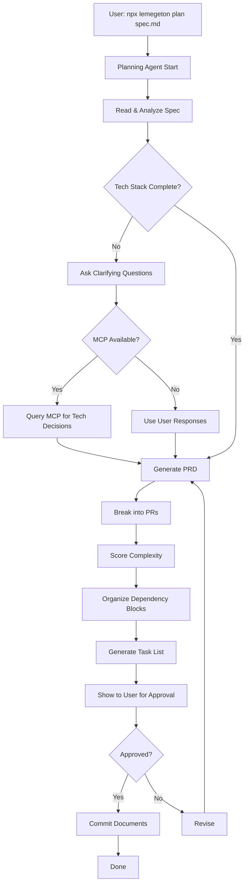

# PR-020: Planning Agent Automation and Enhancement Implementation Plan

**Version:** 1.0
**Date:** 2025-11-14
**Status:** Ready for Implementation
**Dependencies:** PR-011 (BaseAgent) ✅, PR-009 (Task List Parser) ✅, PR-022 (MCP Integration) ✅

---

## Overview

Automate and enhance the existing planning agent prompt (`prompts/planning-agent.yml`) to be callable programmatically by the Hub, adding MCP queries for tech stack decisions and documentation lookups. This transforms the manual planning workflow into an automated agent that can generate PRDs and task lists from project specifications.

## Goals

1. Automate existing planning prompt workflow
2. Integrate with Hub via CLI (`npx lemegeton plan`)
3. Add MCP integration for tech stack verification
4. Implement interactive clarification via AskUserQuestion
5. Generate validated PRD and task list documents
6. Support speculative execution hints
7. Enable complexity scoring integration

## Background

From the PRD:
> **Planning Agent with Speculative Execution:** Reads project spec, interactive tech stack clarification, uses MCP for tech decisions, generates comprehensive PRD with all architectural decisions, breaks PRD into 30-60 minute PRs, organizes PRs into dependency blocks

The planning prompt (`prompts/planning-agent.yml`) already exists and works - it was used to generate this very task list! This PR:
1. **Automates** the prompt to run programmatically
2. **Enhances** with MCP queries for better tech decisions
3. **Integrates** with Hub workflow for seamless operation

## Architecture

### Component Overview

```
┌─────────────────────────────────────────────────────────┐
│              Planning Agent                              │
│  (extends BaseAgent from PR-011)                         │
└────────┬────────────────────────────────┬──────────────┘
         │                                │
         ▼                                ▼
┌──────────────────────┐      ┌──────────────────────────┐
│  Prompt Runner       │      │  MCP Query Engine        │
│  - Load prompt       │      │  - Tech stack lookup     │
│  - Execute workflow  │      │  - Documentation search  │
│  - Generate outputs  │      │  - Version verification  │
└──────────────────────┘      └──────────────────────────┘
         │                                │
         ▼                                ▼
┌──────────────────────┐      ┌──────────────────────────┐
│  Interactive UI      │      │  Document Generator      │
│  - Ask questions     │      │  - PRD template          │
│  - Clarify choices   │      │  - Task list format      │
│  - Validate input    │      │  - YAML frontmatter      │
└──────────────────────┘      └──────────────────────────┘
```

### Workflow



## Implementation Strategy

### Phase 1: Planning Agent Class (10 minutes)

**File:** `src/agents/planning/index.ts`

Main planning agent class extending BaseAgent:

```typescript
import { BaseAgent } from '../base';
import { PromptRunner } from './promptRunner';
import { MCPQueryEngine } from './mcpQueries';
import { DocumentGenerator } from './documentGenerator';
import { InteractiveUI } from './interactive';
import { MCPClient } from '../../mcp/client';

export class PlanningAgent extends BaseAgent {
  private promptRunner: PromptRunner;
  private mcpEngine: MCPQueryEngine;
  private docGenerator: DocumentGenerator;
  private interactive: InteractiveUI;

  constructor(id: string, config: any) {
    super(id, 'planning', config);

    this.promptRunner = new PromptRunner();
    this.mcpEngine = new MCPQueryEngine(this.mcp as MCPClient);
    this.docGenerator = new DocumentGenerator();
    this.interactive = new InteractiveUI();
  }

  /**
   * Main planning workflow
   */
  async plan(specPath: string, options: PlanningOptions = {}): Promise<PlanningResult> {
    try {
      this.emit('activity', 'Starting planning workflow');

      // Step 1: Read and analyze spec
      const spec = await this.readSpec(specPath);
      this.emit('activity', `Analyzed spec: ${spec.title}`);

      // Step 2: Tech stack clarification
      const techStack = await this.clarifyTechStack(spec, options);
      this.emit('activity', `Tech stack confirmed: ${techStack.language}`);

      // Step 3: Generate PRD
      const prd = await this.generatePRD(spec, techStack, options);
      this.emit('activity', 'PRD generated');

      // Step 4: Break into PRs
      const prs = await this.generatePRs(prd, options);
      this.emit('activity', `Generated ${prs.length} PRs`);

      // Step 5: Score complexity
      const scoredPRs = await this.scoreComplexity(prs);
      this.emit('activity', 'Complexity scoring complete');

      // Step 6: Generate task list
      const taskList = await this.generateTaskList(scoredPRs, prd, options);
      this.emit('activity', 'Task list generated');

      // Step 7: Show for approval
      const approved = await this.requestApproval(prd, taskList);

      if (approved) {
        // Step 8: Commit documents
        await this.commitDocuments(prd, taskList);
        this.emit('activity', 'Documents committed');
      }

      return {
        prd,
        taskList,
        approved,
      };
    } catch (error) {
      this.emit('error', `Planning failed: ${error.message}`);
      throw error;
    }
  }

  private async readSpec(path: string): Promise<Spec> {
    // Read and parse spec file
    const content = await fs.readFile(path, 'utf-8');
    return this.promptRunner.parseSpec(content);
  }

  private async clarifyTechStack(
    spec: Spec,
    options: PlanningOptions
  ): Promise<TechStack> {
    // Check if tech stack is complete
    const missing = this.interactive.identifyMissingTechStack(spec);

    if (missing.length === 0) {
      return spec.techStack;
    }

    // Use MCP to suggest options
    const suggestions = await this.mcpEngine.getTechStackSuggestions(spec, missing);

    // Ask user to clarify
    const answers = await this.interactive.askTechStackQuestions(missing, suggestions);

    // Combine with spec
    return {
      ...spec.techStack,
      ...answers,
    };
  }

  private async generatePRD(
    spec: Spec,
    techStack: TechStack,
    options: PlanningOptions
  ): Promise<PRD> {
    return this.docGenerator.generatePRD(spec, techStack, options);
  }

  private async generatePRs(prd: PRD, options: PlanningOptions): Promise<PR[]> {
    return this.promptRunner.breakIntoPRs(prd, options);
  }

  private async scoreComplexity(prs: PR[]): Promise<PR[]> {
    const scorer = new ComplexityScorer();
    return prs.map(pr => ({
      ...pr,
      complexity: scorer.score(pr),
    }));
  }

  private async generateTaskList(
    prs: PR[],
    prd: PRD,
    options: PlanningOptions
  ): Promise<string> {
    return this.docGenerator.generateTaskList(prs, prd, options);
  }

  private async requestApproval(prd: PRD, taskList: string): Promise<boolean> {
    return this.interactive.requestApproval(prd, taskList);
  }

  private async commitDocuments(prd: PRD, taskList: string): Promise<void> {
    await this.docGenerator.writeDocuments(prd, taskList);
    await this.gitCommit(prd, taskList);
  }

  private async gitCommit(prd: PRD, taskList: string): Promise<void> {
    // Git commit with planning message
    const message = this.docGenerator.generateCommitMessage(prd, taskList);
    // Use git operations from state sync
  }
}
```

### Phase 2: Prompt Runner (10 minutes)

**File:** `src/agents/planning/promptRunner.ts`

Execute planning prompt workflow:

```typescript
import { PromptLoader } from '../../services/PromptLoader';
import { Spec, PRD, PR } from '../../types/planning';

export class PromptRunner {
  private loader: PromptLoader;
  private prompt: any; // Planning prompt from planning-agent.yml

  constructor() {
    this.loader = new PromptLoader();
  }

  async loadPrompt(): Promise<void> {
    this.prompt = await this.loader.loadPrompt('planning-agent');
  }

  /**
   * Parse spec file into structured format
   */
  parseSpec(content: string): Spec {
    // Parse markdown spec into structured object
    // Extract title, description, requirements, etc.
    return {
      title: this.extractTitle(content),
      description: this.extractDescription(content),
      requirements: this.extractRequirements(content),
      techStack: this.extractTechStack(content),
    };
  }

  /**
   * Break PRD into individual PRs
   */
  breakIntoPRs(prd: PRD, options: PlanningOptions): PR[] {
    const prs: PR[] = [];

    // Always start with PR-000: Lemegeton setup (unless excluded)
    if (!options.skipLemegetonSetup) {
      prs.push(this.generateLemegetonSetupPR());
    }

    // Generate feature PRs from functional requirements
    const featurePRs = this.generateFeaturePRs(prd);
    prs.push(...featurePRs);

    // Generate test PRs
    const testPRs = this.generateTestPRs(prd, featurePRs);
    prs.push(...testPRs);

    // Always end with architecture docs PR
    prs.push(this.generateArchitectureDocsPR(prd, prs));

    return prs;
  }

  private generateLemegetonSetupPR(): PR {
    return {
      pr_id: 'PR-000',
      title: 'Install and Configure Lemegeton',
      description: 'Establish foundation for parallel agent work',
      cold_state: 'new',
      priority: 'critical',
      dependencies: [],
      estimated_files: [
        {
          path: 'package.json',
          action: 'modify',
          description: 'add lemegeton dependency',
        },
        {
          path: '.gitignore',
          action: 'modify',
          description: 'ensure proper exclusions',
        },
        {
          path: 'docs/task-list.md',
          action: 'create',
          description: 'this file with all PRs',
        },
        {
          path: 'docs/prd.md',
          action: 'create',
          description: 'the PRD document',
        },
      ],
    };
  }

  private generateFeaturePRs(prd: PRD): PR[] {
    // Analyze PRD functional requirements
    // Break into 30-60 minute PRs
    // Organize into dependency blocks
    // This is where the main planning logic happens
    return [];
  }

  private generateTestPRs(prd: PRD, featurePRs: PR[]): PR[] {
    // Generate test PRs that depend on feature PRs
    return [];
  }

  private generateArchitectureDocsPR(prd: PRD, allPRs: PR[]): PR {
    return {
      pr_id: `PR-${allPRs.length.toString().padStart(3, '0')}`,
      title: 'Generate Comprehensive Architecture Documentation',
      description: 'Final documentation with system understanding',
      cold_state: 'new',
      priority: 'medium',
      dependencies: allPRs.map(pr => pr.pr_id),
      estimated_files: [
        {
          path: 'docs/architecture.md',
          action: 'create',
          description: 'comprehensive technical documentation',
        },
      ],
    };
  }

  private extractTitle(content: string): string {
    const match = content.match(/^#\s+(.+)/m);
    return match ? match[1] : 'Untitled Project';
  }

  private extractDescription(content: string): string {
    // Extract description from spec
    return '';
  }

  private extractRequirements(content: string): string[] {
    // Extract requirements list
    return [];
  }

  private extractTechStack(content: string): Partial<TechStack> {
    // Look for tech stack section in spec
    return {};
  }
}
```

### Phase 3: MCP Query Engine (15 minutes)

**File:** `src/agents/planning/mcpQueries.ts`

MCP integration for tech stack decisions:

```typescript
import { MCPClient } from '../../mcp/client';
import { GitHubAdapter } from '../../mcp/adapters/github';
import { NpmAdapter } from '../../mcp/adapters/npm';

export interface TechStackSuggestion {
  category: string;
  options: Array<{
    name: string;
    description: string;
    popularity: string;
    latestVersion?: string;
    documentation?: string;
  }>;
}

export class MCPQueryEngine {
  private github: GitHubAdapter;
  private npm: NpmAdapter;

  constructor(private mcp: MCPClient | null) {
    if (mcp) {
      this.github = new GitHubAdapter(mcp);
      this.npm = new NpmAdapter(mcp);
    }
  }

  /**
   * Get tech stack suggestions using MCP
   */
  async getTechStackSuggestions(
    spec: Spec,
    missing: string[]
  ): Promise<Map<string, TechStackSuggestion>> {
    const suggestions = new Map<string, TechStackSuggestion>();

    if (!this.mcp) {
      // MCP not available, return empty suggestions
      return suggestions;
    }

    for (const category of missing) {
      try {
        const suggestion = await this.getSuggestionForCategory(category, spec);
        if (suggestion) {
          suggestions.set(category, suggestion);
        }
      } catch (error) {
        // Log error but continue with other categories
        console.warn(`MCP query failed for ${category}:`, error.message);
      }
    }

    return suggestions;
  }

  private async getSuggestionForCategory(
    category: string,
    spec: Spec
  ): Promise<TechStackSuggestion | null> {
    switch (category) {
      case 'Web Framework':
        return this.getWebFrameworkSuggestions(spec);
      case 'Database':
        return this.getDatabaseSuggestions(spec);
      case 'Testing Framework':
        return this.getTestingFrameworkSuggestions(spec);
      default:
        return null;
    }
  }

  private async getWebFrameworkSuggestions(spec: Spec): Promise<TechStackSuggestion> {
    const frameworks = ['react', 'next', 'vue', 'svelte'];
    const options = [];

    for (const framework of frameworks) {
      try {
        const pkgInfo = await this.npm.getPackageInfo(framework);
        options.push({
          name: framework,
          description: pkgInfo.description || '',
          popularity: `${(pkgInfo.downloads / 1000000).toFixed(1)}M weekly downloads`,
          latestVersion: pkgInfo.version,
          documentation: pkgInfo.homepage,
        });
      } catch {
        // Skip if package info unavailable
      }
    }

    return {
      category: 'Web Framework',
      options,
    };
  }

  private async getDatabaseSuggestions(spec: Spec): Promise<TechStackSuggestion> {
    // Similar logic for database options
    return {
      category: 'Database',
      options: [
        {
          name: 'PostgreSQL',
          description: 'Powerful, open source object-relational database',
          popularity: 'Industry standard',
        },
        {
          name: 'SQLite',
          description: 'Lightweight, serverless database',
          popularity: 'Great for simple apps',
        },
      ],
    };
  }

  private async getTestingFrameworkSuggestions(spec: Spec): Promise<TechStackSuggestion> {
    // Determine based on language
    if (spec.techStack?.language?.includes('Node')) {
      return {
        category: 'Testing Framework',
        options: [
          { name: 'Jest', description: 'Delightful JavaScript testing', popularity: 'Most popular' },
          { name: 'Vitest', description: 'Blazing fast unit test framework', popularity: 'Growing fast' },
        ],
      };
    }

    return {
      category: 'Testing Framework',
      options: [],
    };
  }

  /**
   * Verify tech stack choices via MCP
   */
  async verifyTechStack(techStack: TechStack): Promise<ValidationResult> {
    const issues: string[] = [];

    // Check for compatibility issues
    // Verify latest versions
    // Check for deprecated packages

    return {
      valid: issues.length === 0,
      issues,
    };
  }
}
```

### Phase 4: Interactive UI (10 minutes)

**File:** `src/agents/planning/interactive.ts`

User interaction for clarification:

```typescript
import { AskUserQuestion } from '../../../tools/askUserQuestion'; // Hypothetical tool
import { TechStack, Spec } from '../../types/planning';

export class InteractiveUI {
  /**
   * Identify missing tech stack components
   */
  identifyMissingTechStack(spec: Spec): string[] {
    const required = [
      'Language/Runtime',
      'Web Framework',
      'Database',
      'Build Tools',
      'Testing Framework',
      'Deployment Target',
    ];

    const missing: string[] = [];

    for (const item of required) {
      if (!this.hasTechStackItem(spec, item)) {
        missing.push(item);
      }
    }

    return missing;
  }

  /**
   * Ask user tech stack clarification questions
   */
  async askTechStackQuestions(
    missing: string[],
    suggestions: Map<string, TechStackSuggestion>
  ): Promise<Partial<TechStack>> {
    const answers: Partial<TechStack> = {};

    for (const category of missing) {
      const suggestion = suggestions.get(category);
      const answer = await this.askCategoryQuestion(category, suggestion);
      answers[this.categoryToKey(category)] = answer;
    }

    return answers;
  }

  private async askCategoryQuestion(
    category: string,
    suggestion?: TechStackSuggestion
  ): Promise<string> {
    const questions = this.buildQuestions(category, suggestion);

    // Use AskUserQuestion tool or prompt user
    // For now, simulate with console interaction
    const response = await this.promptUser(questions);

    return response;
  }

  private buildQuestions(
    category: string,
    suggestion?: TechStackSuggestion
  ): any {
    // Build structured questions for AskUserQuestion tool
    return {
      question: `Which ${category} should the project use?`,
      header: category,
      options: suggestion?.options.map(opt => ({
        label: opt.name,
        description: `${opt.description} (${opt.popularity})`,
      })) || [],
      multiSelect: false,
    };
  }

  /**
   * Request approval for generated documents
   */
  async requestApproval(prd: PRD, taskList: string): Promise<boolean> {
    console.log('\n=== Generated Documents ===\n');
    console.log('PRD Preview:');
    console.log(prd.title);
    console.log(`${prd.sections.length} sections`);
    console.log('\nTask List Preview:');
    const prCount = (taskList.match(/^pr_id:/gm) || []).length;
    console.log(`${prCount} PRs generated`);

    // Show complexity distribution
    console.log('\nComplexity Distribution:');
    // ... show stats

    const approved = await this.promptUser({
      question: 'Does this look correct? Should I commit these documents?',
      header: 'Approval',
      options: [
        { label: 'Yes', description: 'Commit documents' },
        { label: 'No', description: 'Revise' },
      ],
      multiSelect: false,
    });

    return approved === 'Yes';
  }

  private hasTechStackItem(spec: Spec, item: string): boolean {
    // Check if spec has this tech stack item
    return false;
  }

  private categoryToKey(category: string): string {
    // Convert "Web Framework" to "webFramework"
    return category.replace(/\s+/g, '').replace(/^./, c => c.toLowerCase());
  }

  private async promptUser(question: any): Promise<string> {
    // Actual implementation would use AskUserQuestion tool
    // For now, placeholder
    return 'React';
  }
}
```

### Phase 5: Document Generator (10 minutes)

**File:** `src/agents/planning/documentGenerator.ts`

Generate PRD and task list documents:

```typescript
import { PRD, PR, TechStack } from '../../types/planning';

export class DocumentGenerator {
  /**
   * Generate PRD document
   */
  generatePRD(spec: Spec, techStack: TechStack, options: PlanningOptions): PRD {
    return {
      title: spec.title,
      sections: [
        this.generateProductOverview(spec),
        this.generateFunctionalRequirements(spec),
        this.generateTechnicalRequirements(spec, techStack),
        this.generateNonFunctionalRequirements(spec),
        this.generateAcceptanceCriteria(spec),
        this.generateOutOfScope(spec),
      ],
    };
  }

  /**
   * Generate task list markdown
   */
  generateTaskList(prs: PR[], prd: PRD, options: PlanningOptions): string {
    let markdown = '';

    // Document metadata
    markdown += this.generateDocumentMetadata(prs, prd);
    markdown += '\n\n';

    // Organize into blocks
    const blocks = this.organizeDependencyBlocks(prs);

    for (const block of blocks) {
      markdown += this.generateBlock(block);
      markdown += '\n\n';
    }

    return markdown;
  }

  private generateDocumentMetadata(prs: PR[], prd: PRD): string {
    const totalComplexity = prs.reduce((sum, pr) => sum + (pr.complexity?.score || 0), 0);
    const haikuCount = prs.filter(pr => pr.complexity?.suggested_model === 'haiku').length;
    const sonnetCount = prs.filter(pr => pr.complexity?.suggested_model === 'sonnet').length;
    const opusCount = prs.filter(pr => pr.complexity?.suggested_model === 'opus').length;

    return `# Task List for ${prd.title}

## Orchestration Metadata
**Generated for:** Lemegeton v1.0+
**Estimated Total Complexity:** ${totalComplexity}
**Recommended Agent Configuration:**
- Haiku agents: ${haikuCount} (for complexity 1-3)
- Sonnet agents: ${sonnetCount} (for complexity 4-7)
- Opus agents: ${opusCount} (for complexity 8-10)`;
  }

  private organizeDependencyBlocks(prs: PR[]): Block[] {
    // Organize PRs into dependency blocks for parallel execution
    // This is topological sort with block grouping
    return [];
  }

  private generateBlock(block: Block): string {
    let markdown = `## Block ${block.id}: ${block.title}\n\n`;

    for (const pr of block.prs) {
      markdown += this.generatePRSection(pr);
      markdown += '\n\n';
    }

    return markdown;
  }

  private generatePRSection(pr: PR): string {
    return `### ${pr.pr_id}: ${pr.title}

---
pr_id: ${pr.pr_id}
title: ${pr.title}
cold_state: ${pr.cold_state}
priority: ${pr.priority}
complexity:
  score: ${pr.complexity?.score || 0}
  estimated_minutes: ${pr.complexity?.estimated_minutes || 0}
  suggested_model: ${pr.complexity?.suggested_model || 'sonnet'}
  rationale: ${pr.complexity?.rationale || ''}
dependencies: ${JSON.stringify(pr.dependencies || [])}
estimated_files:
${pr.estimated_files?.map(f => `  - path: ${f.path}
    action: ${f.action}
    description: ${f.description}`).join('\n') || ''}
---

**Description:**
${pr.description}

**Acceptance Criteria:**
${this.generateAcceptanceCriteria(pr)}

**Notes:**
${pr.notes || 'No additional notes.'}`;
  }

  private generateAcceptanceCriteria(pr: PR): string {
    // Generate checkboxes for acceptance criteria
    return pr.acceptanceCriteria?.map(c => `- [ ] ${c}`).join('\n') || '- [ ] Implementation complete';
  }

  private generateProductOverview(spec: Spec): PRDSection {
    return {
      title: 'Product Overview',
      content: spec.description,
    };
  }

  private generateFunctionalRequirements(spec: Spec): PRDSection {
    return {
      title: 'Functional Requirements',
      content: spec.requirements.join('\n'),
    };
  }

  private generateTechnicalRequirements(spec: Spec, techStack: TechStack): PRDSection {
    return {
      title: 'Technical Requirements',
      content: `Technology Stack:
- Language/Runtime: ${techStack.language}
- Web Framework: ${techStack.webFramework}
- Database: ${techStack.database}
- Testing: ${techStack.testingFramework}
- Deployment: ${techStack.deploymentTarget}`,
    };
  }

  private generateNonFunctionalRequirements(spec: Spec): PRDSection {
    return {
      title: 'Non-Functional Requirements',
      content: 'Performance, security, scalability requirements...',
    };
  }

  /**
   * Write documents to disk
   */
  async writeDocuments(prd: PRD, taskList: string): Promise<void> {
    await fs.writeFile('docs/prd.md', this.formatPRD(prd));
    await fs.writeFile('docs/task-list.md', taskList);
  }

  private formatPRD(prd: PRD): string {
    let markdown = `# ${prd.title}\n\n`;

    for (const section of prd.sections) {
      markdown += `## ${section.title}\n\n${section.content}\n\n`;
    }

    return markdown;
  }

  /**
   * Generate git commit message
   */
  generateCommitMessage(prd: PRD, taskList: string): string {
    const prCount = (taskList.match(/^pr_id:/gm) || []).length;

    return `[Planning] Initial PRD and task list for ${prd.title} with Lemegeton orchestration

PRD includes:
- Product overview and requirements
- Technical architecture decisions
- Acceptance criteria

Task list includes:
- ${prCount} PRs with YAML frontmatter for reliable parsing
- Complexity scores for cost-optimized routing
- Estimated file lists for conflict detection

Ready for Lemegeton Hub orchestration.`;
  }
}
```

### Phase 6: CLI Integration (5 minutes)

**File:** `src/cli/commands/plan.ts`

CLI command for planning:

```typescript
import { Command } from 'commander';
import { PlanningAgent } from '../../agents/planning';

export function createPlanCommand(): Command {
  return new Command('plan')
    .description('Run planning agent to generate PRD and task list')
    .argument('<spec-file>', 'Path to specification file')
    .option('--output <path>', 'Output directory for documents', 'docs')
    .option('--interactive', 'Enable interactive mode', true)
    .option('--mcp', 'Enable MCP queries for tech decisions', true)
    .option('--skip-lemegeton-setup', 'Skip PR-000 for Lemegeton setup', false)
    .action(async (specFile, options) => {
      await runPlanningAgent(specFile, options);
    });
}

async function runPlanningAgent(specFile: string, options: any): Promise<void> {
  console.log(`Planning from spec: ${specFile}`);

  // Create planning agent
  const agent = new PlanningAgent('planning-agent-001', {
    enableMCP: options.mcp,
    interactive: options.interactive,
  });

  try {
    // Initialize agent
    await agent.start();

    // Run planning workflow
    const result = await agent.plan(specFile, {
      outputPath: options.output,
      skipLemegetonSetup: options.skipLemegetonSetup,
    });

    if (result.approved) {
      console.log('\n✓ Planning complete!');
      console.log(`  PRD: ${options.output}/prd.md`);
      console.log(`  Task list: ${options.output}/task-list.md`);
      console.log('\nNext steps:');
      console.log('  1. Review the generated documents');
      console.log('  2. Run `npx lemegeton hub start` to begin orchestration');
    } else {
      console.log('\n✗ Planning cancelled by user');
    }
  } catch (error) {
    console.error('Planning failed:', error);
    process.exit(1);
  } finally {
    await agent.stop();
  }
}
```

## File Structure

```
src/agents/planning/
├── index.ts              # Main planning agent class
├── promptRunner.ts       # Prompt execution logic
├── mcpQueries.ts         # MCP integration
├── interactive.ts        # User interaction
└── documentGenerator.ts  # Document generation

src/cli/commands/
└── plan.ts               # Planning CLI command

tests/
└── planning.test.ts      # Planning agent tests
```

## Dependencies

### Internal Dependencies

- `src/agents/base.ts` (PR-011) - BaseAgent class
- `src/parser/taskList.ts` (PR-009) - Task list parsing
- `src/mcp/client.ts` (PR-022) - MCP integration
- `src/cost/complexityScorer.ts` (PR-018) - Complexity scoring
- `prompts/planning-agent.yml` (PR-003a) - Planning prompt

### No New External Dependencies

All functionality uses existing dependencies.

## Integration Points

### Hub Integration

Hub can trigger planning agent:

```typescript
// In Hub
async runPlanning(specPath: string): Promise<void> {
  const agent = this.spawnAgent('planning', 'planning-agent-001');
  await agent.plan(specPath);
}
```

### CLI Integration

Users invoke via CLI:

```bash
npx lemegeton plan ./spec.md
```

## Testing Strategy

### Unit Tests

```typescript
describe('PlanningAgent', () => {
  test('reads and parses spec', async () => {
    // Test spec parsing
  });

  test('identifies missing tech stack', () => {
    // Test tech stack detection
  });

  test('generates PRD from spec', async () => {
    // Test PRD generation
  });

  test('breaks PRD into PRs', () => {
    // Test PR generation
  });

  test('generates task list with YAML', () => {
    // Test task list formatting
  });
});

describe('MCPQueryEngine', () => {
  test('queries npm for package info', async () => {
    // Test MCP queries
  });

  test('handles MCP unavailability gracefully', async () => {
    // Test fallback behavior
  });
});
```

### Integration Tests

```typescript
describe('Planning Workflow', () => {
  test('end-to-end planning from spec', async () => {
    // Test full workflow
  });

  test('interactive tech stack clarification', async () => {
    // Test user interaction
  });
});
```

## Success Criteria

- [ ] Existing planning prompt callable programmatically
- [ ] Integrated into Hub workflow (npx lemegeton plan)
- [ ] MCP queries for tech stack verification
- [ ] Interactive clarifications automated
- [ ] Task list generation validated
- [ ] Complexity scoring integrated
- [ ] Test coverage >85%
- [ ] Documents follow correct format
- [ ] Git commits work correctly

## Future Enhancements

### Post-PR Improvements

1. **Speculative Execution** (PR-021)
   - Pre-analyze task patterns
   - Predict file conflicts
   - Suggest agent allocation

2. **Advanced MCP Queries**
   - Search GitHub for similar projects
   - Analyze tech stack compatibility
   - Recommend best practices

3. **Template Library**
   - Common project templates
   - Domain-specific patterns
   - Starter PRs

4. **Iterative Refinement**
   - User can request revisions
   - Agent learns from feedback
   - Continuous improvement

## Risk Mitigation

### Risk: Poor PR Breakdown Quality

**Mitigation:**
- Clear prompts for 30-60 minute PRs
- Dependency validation
- User review before commit
- Iterative refinement

### Risk: MCP Query Failures

**Mitigation:**
- Graceful fallback to user input
- Cache MCP responses
- Retry logic with backoff
- Clear error messages

### Risk: Interactive Questions Too Frequent

**Mitigation:**
- Only ask when truly ambiguous
- Batch related questions
- Remember previous answers
- Allow batch/non-interactive mode

## Timeline

- **Phase 1:** Planning agent class (10 min)
- **Phase 2:** Prompt runner (10 min)
- **Phase 3:** MCP query engine (15 min)
- **Phase 4:** Interactive UI (10 min)
- **Phase 5:** Document generator (10 min)
- **Phase 6:** CLI integration (5 min)

**Total:** 60 minutes (as estimated in task list)

## Acceptance Criteria

From task list (PR-020):
- [ ] Existing planning prompt callable programmatically
- [ ] Integrated into Hub workflow (npx lemegeton plan)
- [ ] MCP queries for tech stack verification
- [ ] Interactive clarifications automated
- [ ] Task list generation validated
- [ ] Complexity scoring consistent

## Example Usage

```bash
# Run planning agent
npx lemegeton plan ./my-spec.md

# Output:
# Planning from spec: ./my-spec.md
# Analyzed spec: My Awesome Project
#
# I see this is a web app. Which framework should I use?
# 1. React (Most popular)
# 2. Next.js (Great for SSR)
# 3. Vue (Progressive framework)
# 4. Other
#
# > 2
#
# Tech stack confirmed: Next.js
# PRD generated
# Generated 25 PRs
# Complexity scoring complete
# Task list generated
#
# === Generated Documents ===
#
# PRD Preview:
# My Awesome Project
# 6 sections
#
# Task List Preview:
# 25 PRs generated
#
# Complexity Distribution:
# - Haiku: 10 PRs
# - Sonnet: 12 PRs
# - Opus: 3 PRs
#
# Does this look correct? Should I commit these documents?
# > Yes
#
# ✓ Planning complete!
#   PRD: docs/prd.md
#   Task list: docs/task-list.md
#
# Next steps:
#   1. Review the generated documents
#   2. Run `npx lemegeton hub start` to begin orchestration
```

## References

- `prompts/planning-agent.yml` - Existing planning prompt
- PRD Section: Planning Agent with Speculative Execution (Feature #3)
- PR-003a: Prompt translation
- PR-011: BaseAgent class
- PR-022: MCP integration
- PR-018: Complexity scoring
